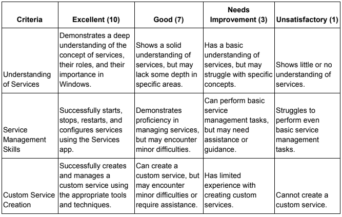

SYSADM1 -- Managing Services in Windows\
Requirement:\
• A virtual machine running Linux and Windows OS

**Services** are background processes that run independently of user
interactions in Windows. They provide essential system functions, such
as network connectivity, printing, and time synchronization. This lab
will guide you through the process of managing services using the
Services app.

Instructions:\
1. Open the Start menu and search for \"Services\"

2\. Familiarize yourself with the columns, including Service Name,
Display Name, Status, and Startup type.

3\. Right-click on a service and select \"Start\", \"Stop\", or
\"Restart\". Fill out the table below

Page **2** of **7**

4\. Select five network services, right-click to view its properties.
Modify the startup setting to

> Manual.

Page **3** of **7**

Page **4** of **7**

5\. Explore the \"General\", \"Recovery\", and \"Log On\" tabs to
understand additional service settings. 6. Create a batch file that will
be added as a new service later on. Refer to the batch file code below.

7\. Save the batch file in Z:\\lastname_timer.bat\
8. Use the sc command to add timer.bat service in the command line
interface. *sc create BatchTimerService binPath=
\"path_to_your_batch_file.bat\" start= auto* *net start
BatchTimerService*

Page **5** of **7**

> **Replace path_to_your_batch_file.bat with the actual path to your
> batch file.** 
9. Verify that BatchTimerService has been added to the services.
**SS:**

> 10\. **Testing the Service:** Now, if you open a new command prompt,
> you should see the timer countdown without requiring your interaction.
> Once the timer finishes, you\'ll see the \"Timer finished!\" message.
>
> **SS:**

>
> **Rubric**
>
> {width="3.1055555555555556in"
> height="2.272221128608924in"}

Page **6** of **7**

Page **7** of **7**
